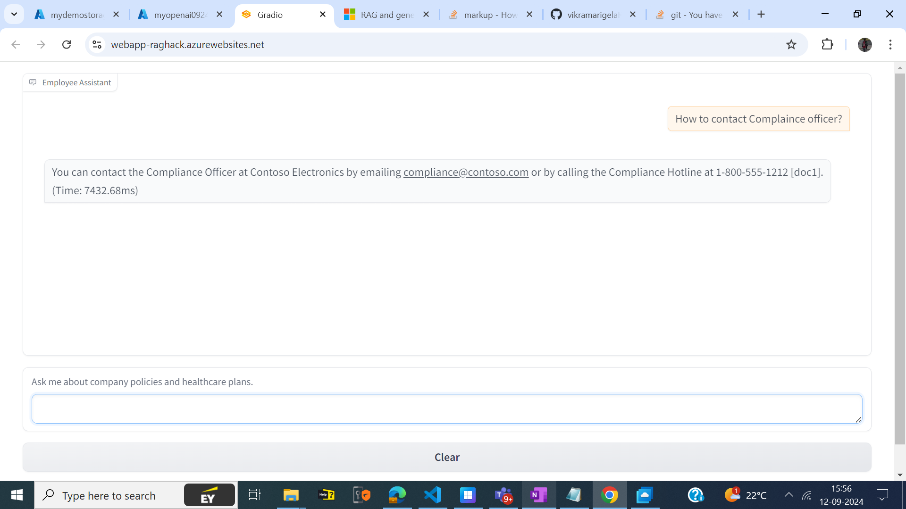
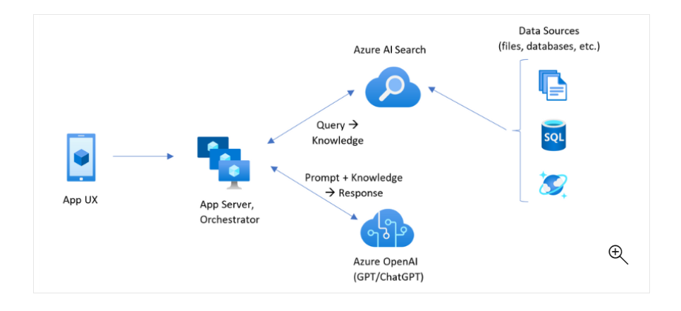
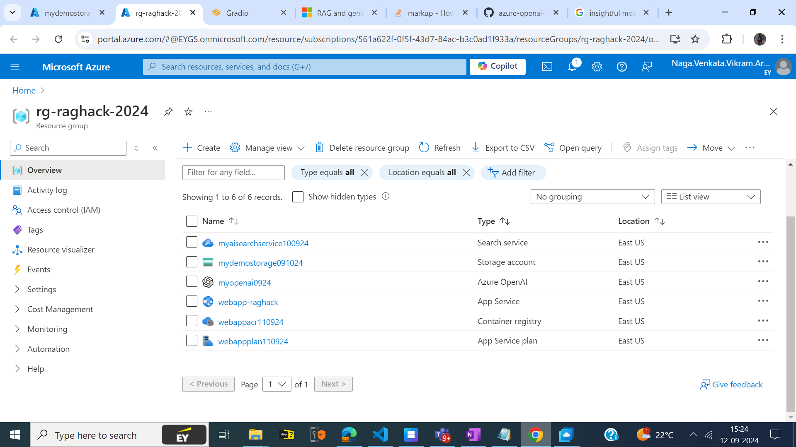

# Implement RAG with Azure Open AI Service and Azure AI Search Service
This Repo contains code to implement rag using azure open ai and azure ai search

# Project Overview
Employee Assistant is an Chat bot built using Azure open ai, Azure Search and python where employees can find answers to their questions regarding healthcare plans and company policies for a fictitious company called contoso.

!

# About RAG
Retrieval Augmented Generation (RAG) is an architecture that augments the capabilities of a Large Language Model (LLM) like ChatGPT by adding an information retrieval system that provides grounding data.
Two main components for implementing RAG is retriver and generator. In this project Azure AI Search Service is used as retriever and Azure Open AI Service as generator.

# Architecture diagram

!

 * App UX (web app) for the user experience
 * App server or orchestrator (integration and coordination layer)
 * Azure AI Search (information retrieval system)
 * Azure OpenAI (LLM for generative AI)

# Data Ingestion Overview

Data Ingestion is done using jupyter notebook "azure_ai_search_intvec.ipynb". Execute each cell one-by-one to complete ingestion process. Data Ingestion does the following things. RBAC has been used top ingest the data and build the index.
  
  * Install Dependencies(cell 1)
  * loads environment variables
  * uploads files from "data" folder to azure storage account
  * Creates a datasource for blob storage in Azure AI Search Service.
  * Creates Search Index in Azure AI Search Service using Integrated Vectorization.
  * Creates SkillSets for chunking and vectorizing data.
  * Creates Indexer that vectorizes data and build the index ready to be used.

Following are the RBAC Roles used for ingestion process. If you are uploading data from cli or vs code, then you should have following roles for this to work or if you're using a azure function app to run this ingestion then the function app should be assigned following roles.

* Donot Forgot to enable Role based access control for Azure AI Search Service.

 * To update Azure AI Search
   * Azure AI Developer
   * Cognitive Services OpenAI Contributor
   * Search Service Contributor

 * To upload files to Azure Blob Storage
   * Storage Blob Data Contributor

* After Indexer has run succesfully, you can run following cells .

  * Run the 2 cells with Tag "test the chat app locally" to play around the chat app.
  * Run the cell with Tag "Vector Search" to query data from index.

# Application Overview

Following azure services have been used to build this application. pfb..screenshot of the resource group.

Code for the application is under "app" folder. main.py contains code for implementing this application

!

 * AppService
 * Azure AI Search(used as Retriever)
 * Azure Open AI Service(Generative AI)
 * Azure Container Registry(Host docker images)
 * Azure Blob Storage(Data Source to upload files)

 * Gradio+FastAPI+python is used to design UI for the chat application.

 * Key less authentication has been used for all services in this project. Azure AD Auth has been implemented for improved security for services to communicate with each other.

 * Following Roles have been used

   * Note: Enable System Assigned managed identity for all the services

   * For Azure App Service to connect with Azure Open AI Service
     * Role : Azure AI Developer

   * For Azure App Service to connect with Azure AI Search Service
     * Role: Search Service Contributor

   * For Azure Open AI Service to connect with Azure AI Search Service
     * Role: Search Index Data Reader
     * Role: Search Service Contributor